# Overview

Type: mobile wallet

Developer URL: [https://digital.gov.bc.ca/digital-trust/showcase/](https://digital.gov.bc.ca/digital-trust/showcase/)

Demo: [https://digital.gov.bc.ca/](https://digital.gov.bc.ca/)

# Identity Lifecycle

## Provision

Users read a QR code in order to receive a VC.

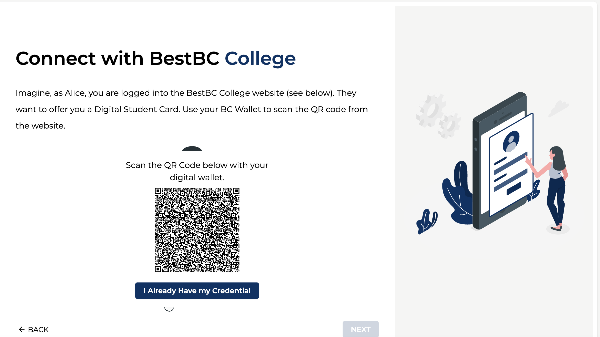

Upon receiving the credential offer, users can accept it and have it stored in their wallet.

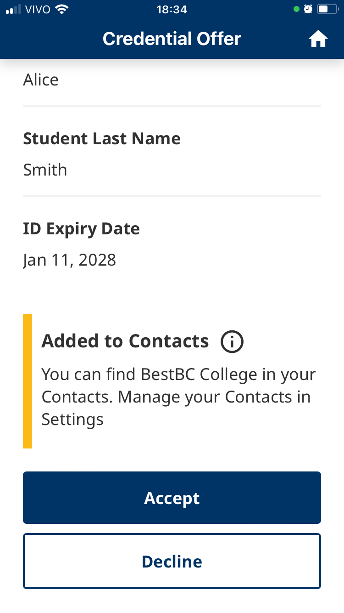

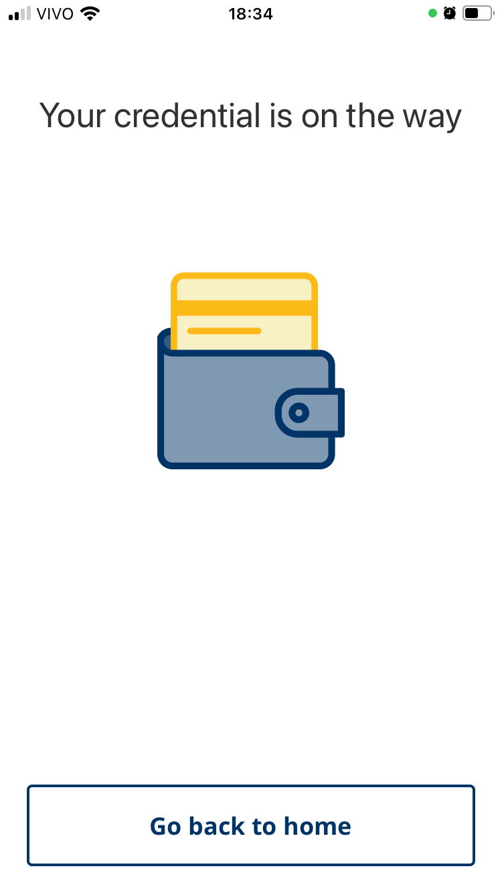

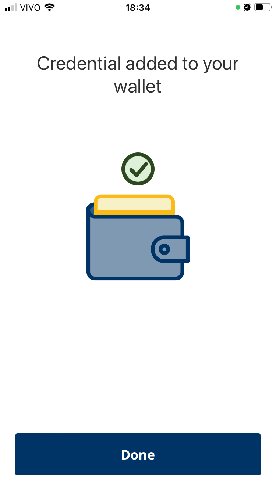

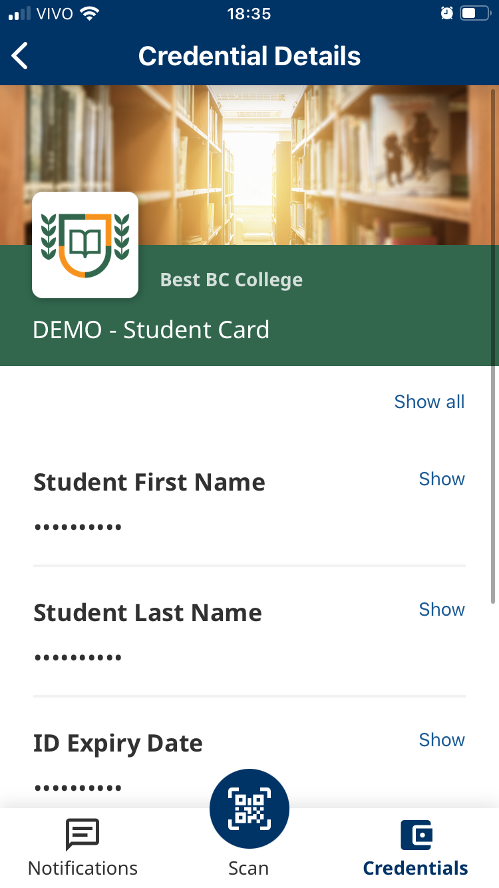

### Privacy considerations

1. The wallet application requires a PIN to be entered for access and can also be set up to utilise the device's biometric unlocking feature.

## Usage, Update and Maintainance

Users can present the VC in use cases like booking a study room or buying online with student discounts.

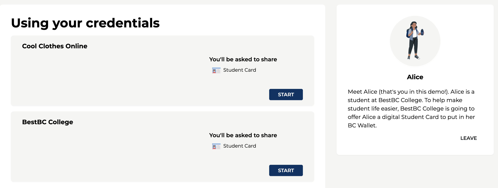

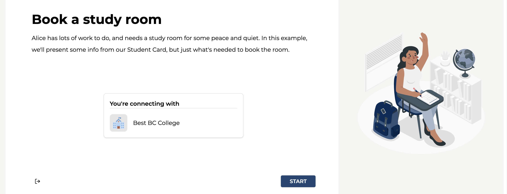

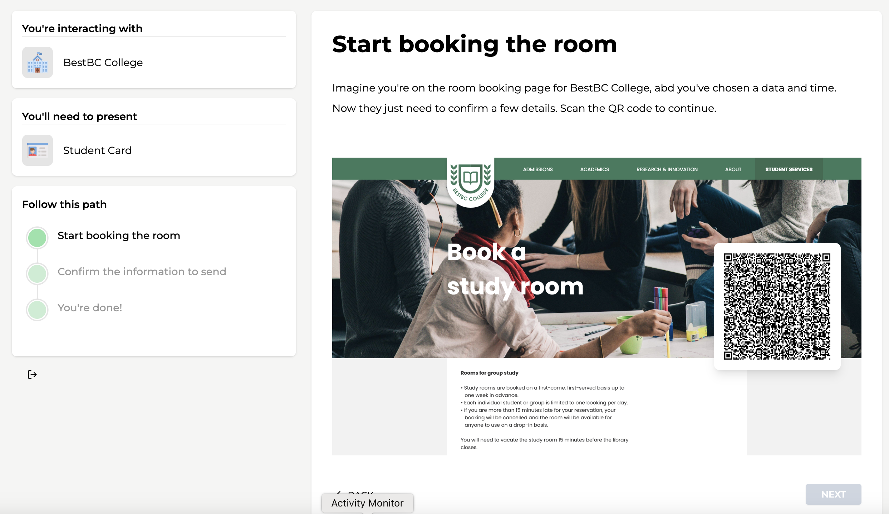

After reading the QR code, users receive a hint about the operation:

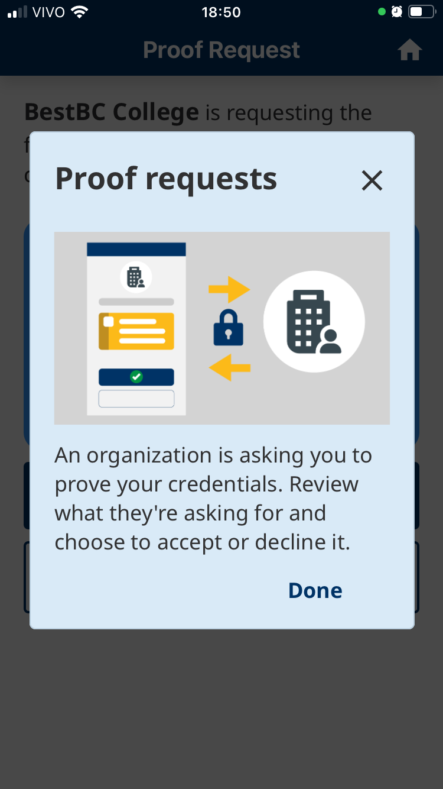

A valid VC is pre-selected for user to share.

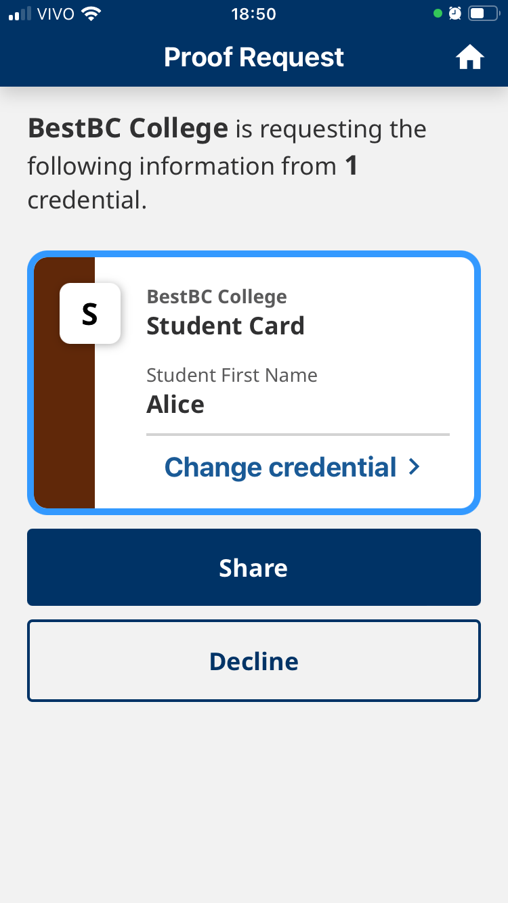

After sharing, the requested info is shown in the web form of the verifier:

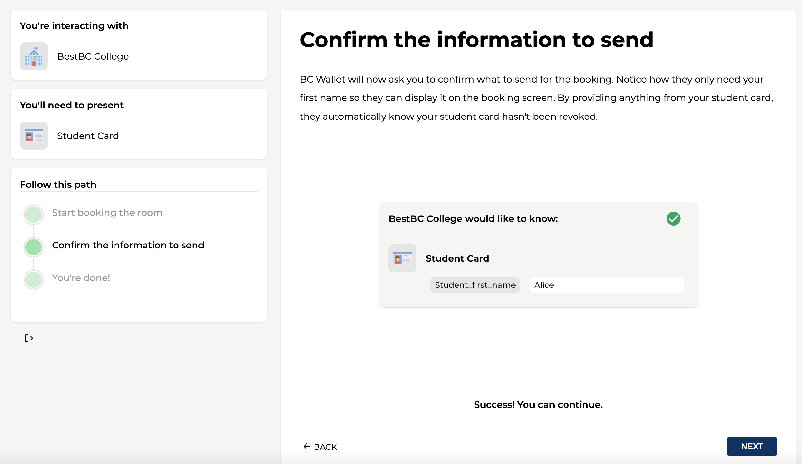

The user is now validated and can finish the booking.

### Privacy considerations

1. Users receive a notice/hint about the operation being performed.
2. If more than one valid credential is on the wallet, one is pre-selected and the user is provided with a 'change credential' option. Needs further analysis is this could lead users to share unintended VCs.
   

## De-provision

Users can remove a credential from the wallet.

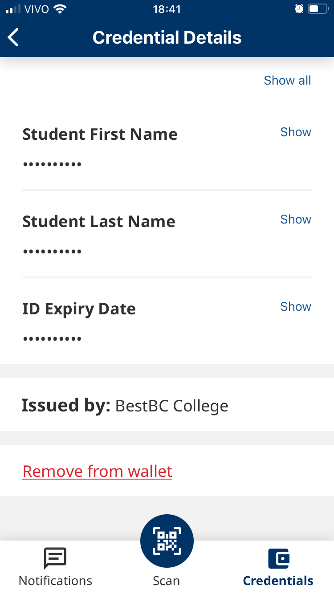

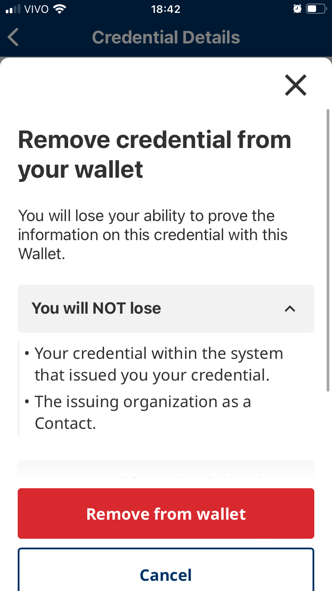

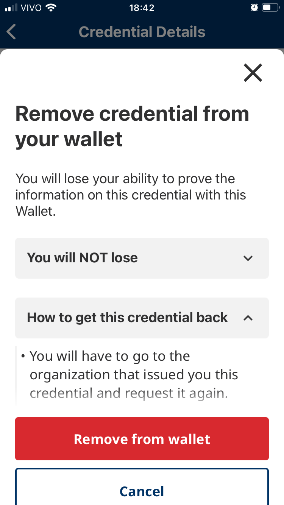

# Final Remarks

Offers a guide when the wallet is opened, to show how to use the app.

