# Overview

Type: mobile wallet

Developer URL: [https://igrant.io/](https://igrant.io/)

Demo: [https://igrant.io/datawallet.html](https://igrant.io/datawallet.html)

# Identity Lifecycle

## Provision

An issuer issues a verifiable credential for a subject. For instance, the individual verifies their identity with an issuer (an onboarding process out-of-scope) and requests the issuance of a Verifiable Credential (VC).

Users read a QR code to identify themselves and request the issuance of a VC, using some identification protocol (in the demo, a PIN for an OpenID workflow).

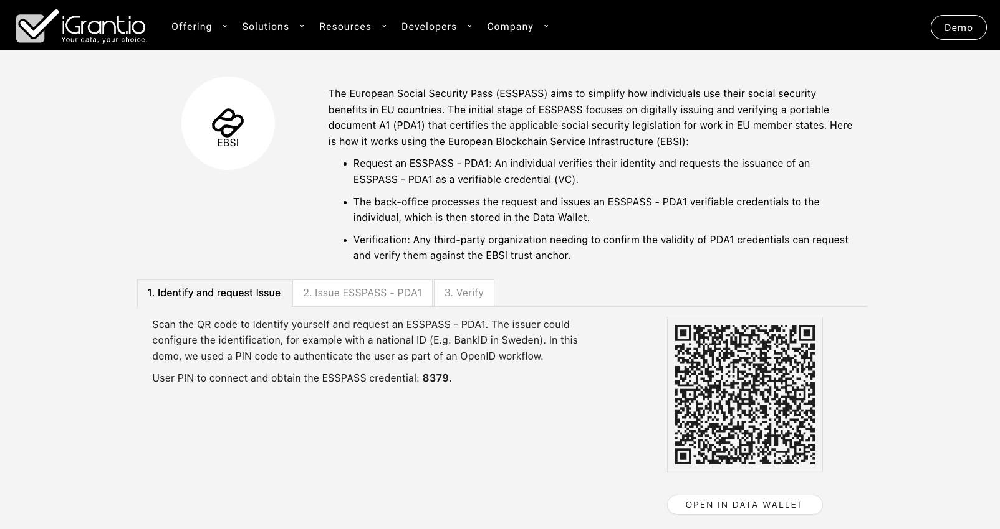

After reading the code, the user inserts a PIN to proceed (it could be any other identification protocol the issuer uses for this step).

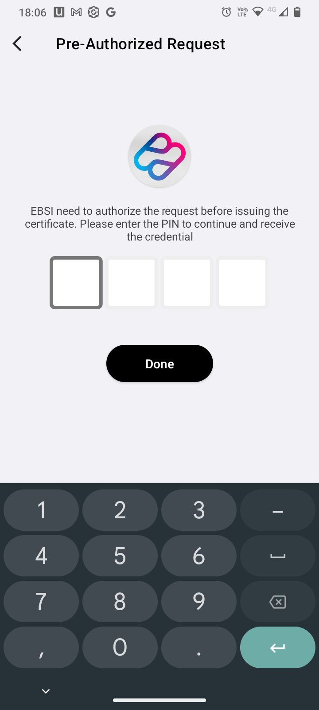

If the user doesn't already have a (DID) connection with that issuer, the wallet asks the user to accept a connection.

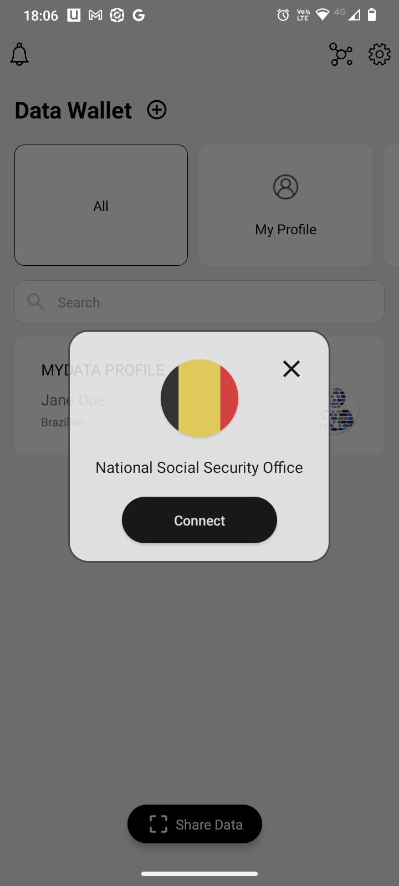

After the identification and/or acceptance of the connection, the user requests the issuance of a VC.

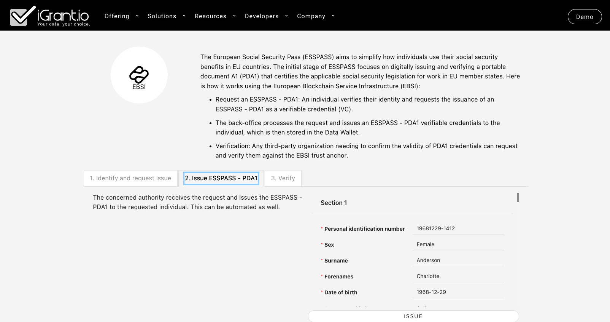

After requesting the issuance, the user receives a VC offer.

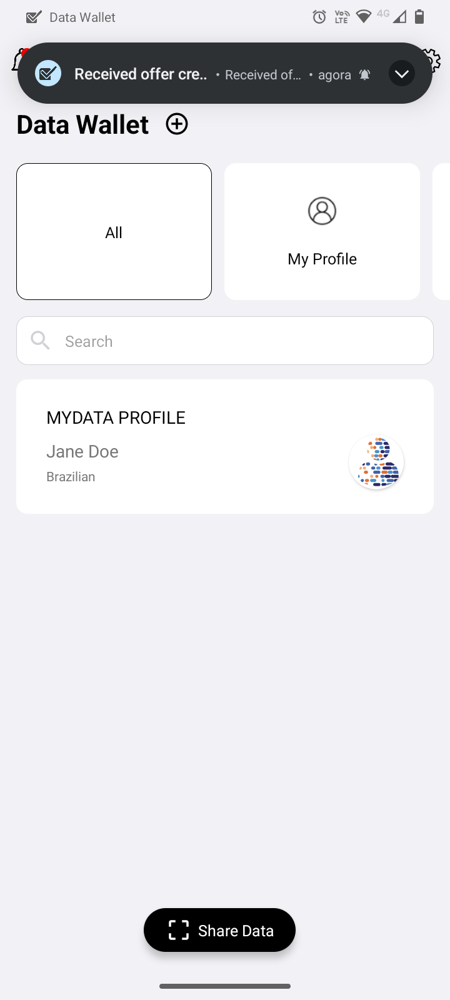

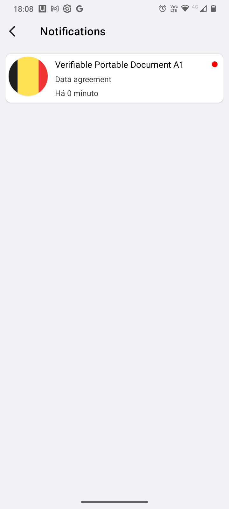

After selecting the offer in the VC offer notification, the user can see the VC details and accept it.

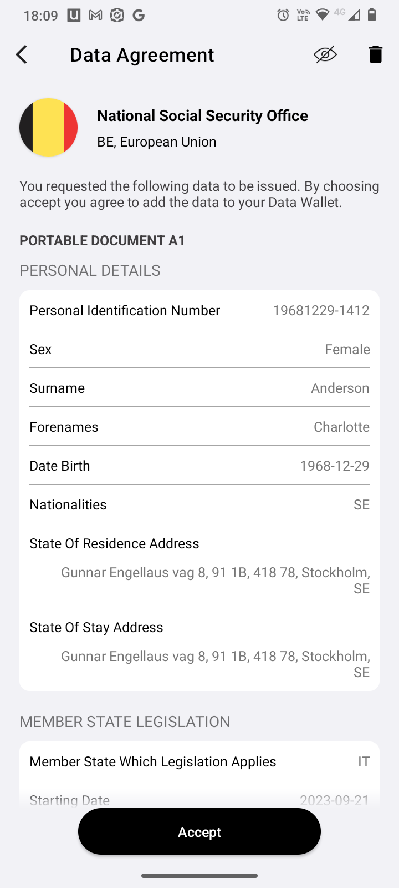

After accepting it, the VC is listed in the wallet

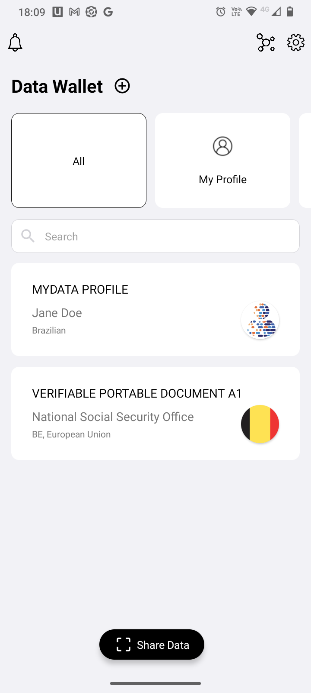

If the user has more than one VC, it is shown as a grouped listing:

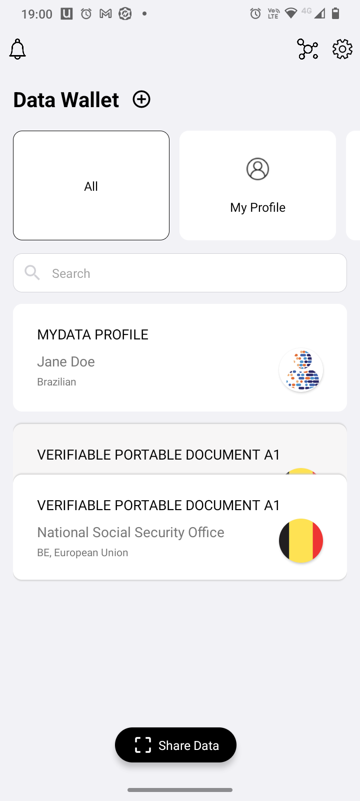

### Privacy considerations

1. The wallet provides a biometric unlocking option, facilitating secure access to the app.

## Usage, Update and Maintainance

In the usage phase, the user's first step is to establish a connection with the verifier, by reading a QR code. 

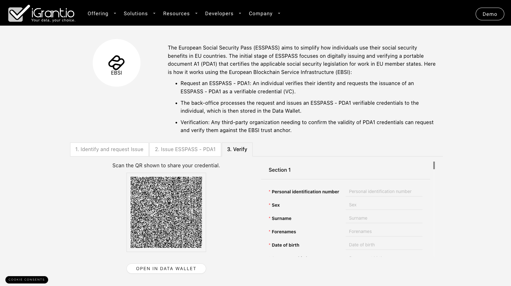

After reading the QR code, if it is the first time reading it, the user is asked to establish a connection with the verifier. This step is skipped if a previous connection was established

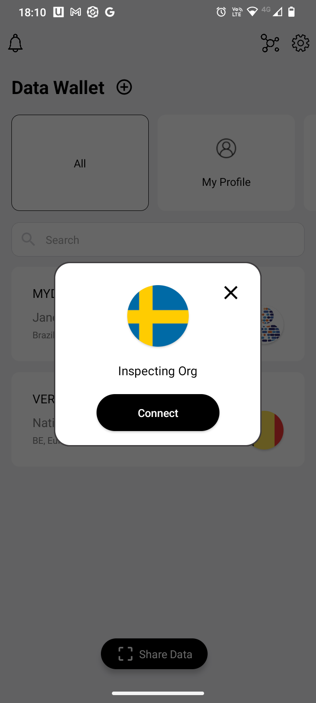

Upon establishing the connection, the verifiable credential data intended for sharing becomes available. Users can manage the visibility of this data by accessing the visibility configuration, which can be adjusted by tapping the eye icon located in the top right corner of the screen. This action allows users to toggle between making the data visible or hidden on the app screen. It's important to notice that this feature doesn't impact the data intended for sharing (known as selective disclosure). Instead, it solely influences the visibility of information within the app interface, preventing unauthorized viewing by others over one's shoulder.

Once the user confirms, data is shared and the wallet confirms.

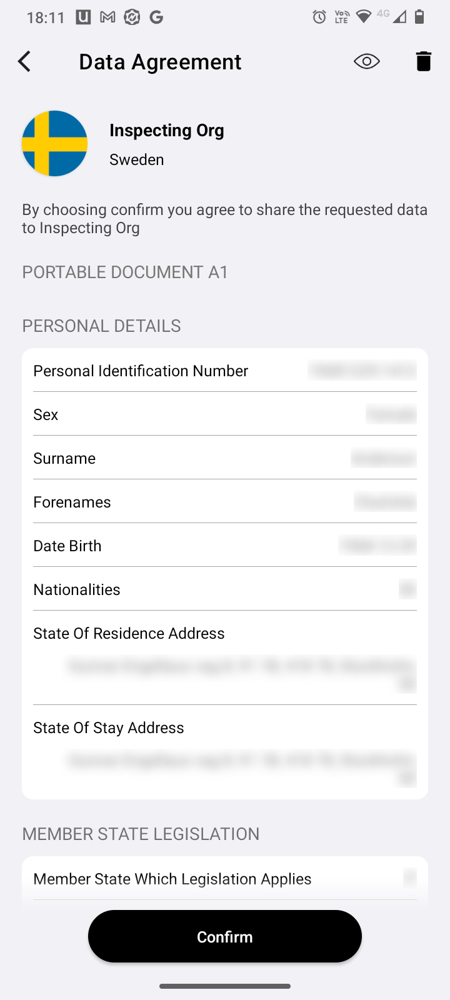

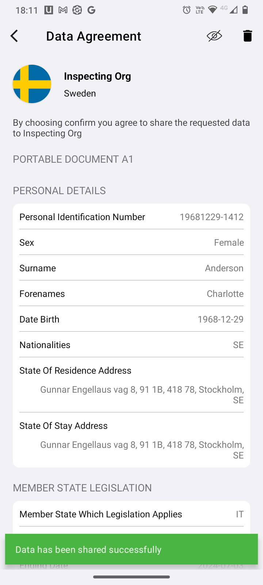

Following the data-sharing process, the user's information is used to complete the requested form by the verifier, and the completed form is displayed on the screen.

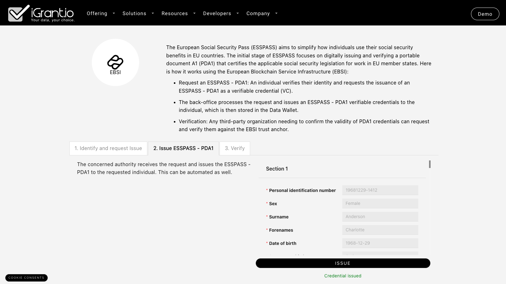

When a user possesses multiple Verifiable Credentials (VCs) meeting the criteria, the wallet seems to select the first one and displays a message indicating the presence of multiple credentials. As there is no emphasis on this information, there's a possibility that the user might not notice it, potentially leading to inadvertently sharing incorrect or unintended information.

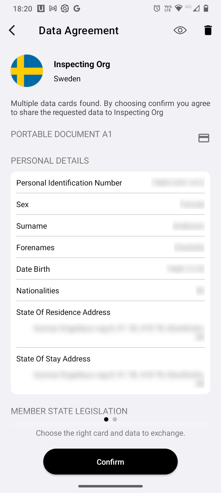

The wallet has a *my shared data* feature, with a search option, that lists users interactions both receiving credentials as well as sharing data.

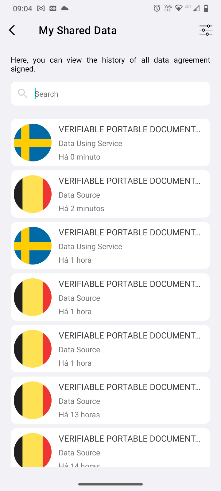

### Privacy considerations
1. If a user holds multiple credentials that match the required type by the verifier, one of these credentials is automatically chosen and shown by default. The user might not be aware that they can change the pre-selected credential or might overlook this option, leading to the unintentional sharing of an incorrect credential.
2. The searchable history of shared data has the potential to offer users transparency and control. However, at this stage, it's somewhat confusing as it combines the history of received credentials with shared data.
3. The wallet aims to accommodate multiple use cases, such as digitising scanned documents, which might not align with the terminology commonly used in specialised self-sovereign/decentralised identity wallets. For instance, terms like *data card* encompass various types of "cards" within the wallet, including VCs. Another instance is the inclusion of *data agreement signed* within the *My Shared Data* section, covering both received and shared "data cards". Standardising the terminology is expected to enhance users' awareness of privacy implications when sharing their data.

## De-provision

Once in their wallets, users can delete a VC (which the wallet app calls *data card*).

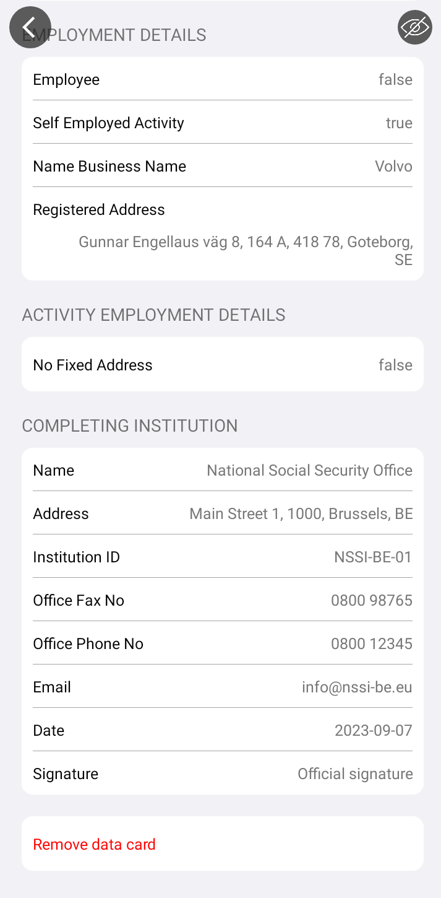

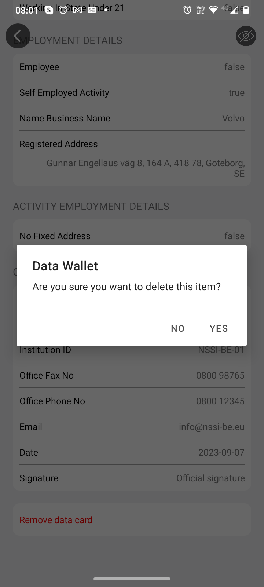

# Final Remarks

The scenario described, specifically focusing on the European Social Security Pass (ESSPASS) and the issuance of verifiable credentials (VCs) through the European Blockchain Service Infrastructure (EBSI), aligns with the broader principles of self-sovereign identity and decentralised identity. These principles emphasize user control, privacy, and the ability to manage one's identity and credentials.

Overall privacy considerations encompass various aspects:

1. The wallet offers secure access through biometric unlocking, enhancing app security.
2. Automatic selection of credentials might lead users to unintentionally share incorrect credentials due to a lack of awareness or oversight in changing the pre-selected option.
3. The searchable history, while potentially empowering users with transparency and control, currently combines received credentials with shared data, which may confuse.
4. The terminology used within the wallet, like "data card" and "data agreement signed," might differ from standard self-sovereign identity vocabulary. Standardising terminology is crucial to raise user awareness regarding privacy implications when sharing their data across multiple use cases.