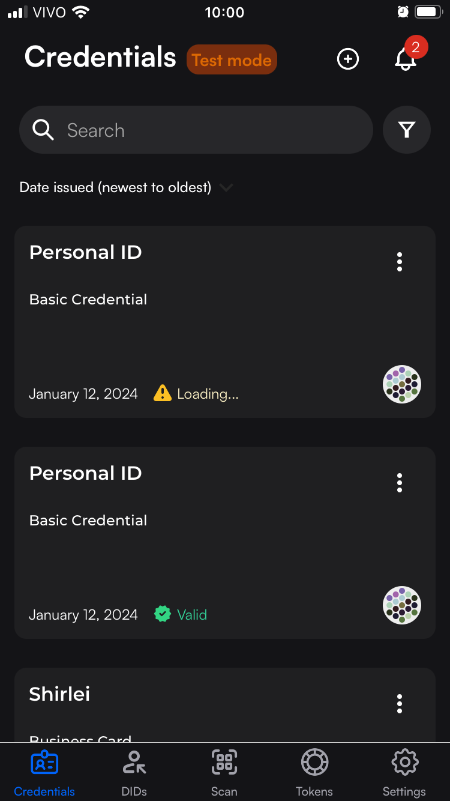
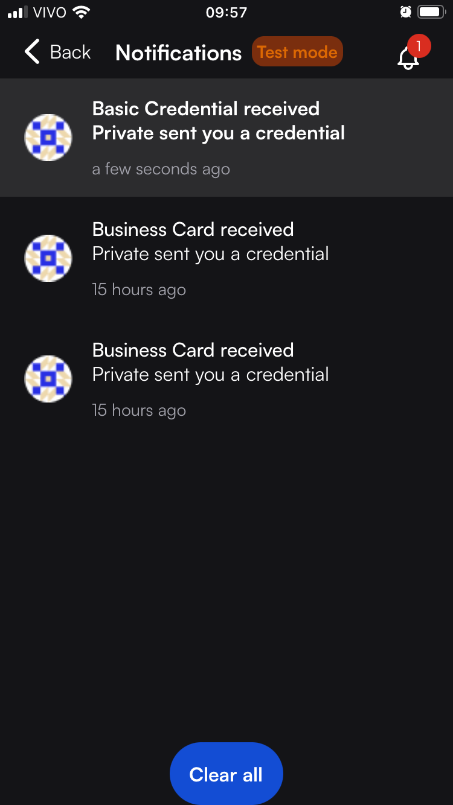
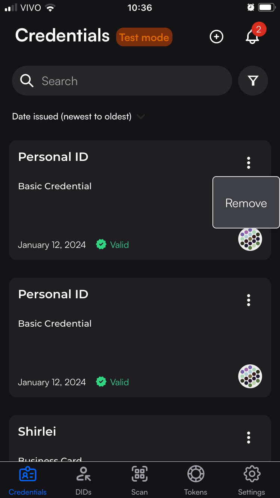

# Overview

Type:  mobile wallet

Developer URL: [https://www.dock.io/](https://www.dock.io/)

Demo: [https://certs.dock.io/](https://certs.dock.io/)

# Identity Lifecycle

## Provision

The user can receive a VC by scanning a QR code or importing a JSON file.
At least in the demo, the received email with the QR code says it will expire within 1 week.
The QR code can be scanned only once (a second scanning is no longer valid).

After scanning the QR code, the credential is immediately loaded into the wallet. 

There is a notification informing that a credential was received.

### Privacy considerations

1. The wallet application requires a PIN to be entered for access and can also be set up to utilise the device's biometric unlocking feature.
2. As credentials are stored immediately after scanning the QR code, lacking additional details for users,  like issuer information or a notice about storing a VC, it suggests developers anticipate users already having this information or envision a controlled organisational context for credential issuance.
3. In line with standard practices seen in most online services, the cloud wallet in the free plan requires users to provide an email address. In the absence of an email confirmation process, it's essential to establish a means of verifying that the intended recipient is the rightful owner of the provided email address. Without such verification measures, there's a risk that the verifiable credential could be inadvertently delivered to an unintended recipient. 

## Usage, Update and Maintainance

No use case available on Jan 12th, 2024. 
On the website it is declared as "Coming soon":
   - Share your credentials for verification.
   - Selective Disclosure: only share specific information from one credential.
   - Zero-Knowledge Proofs: prove something about yourself without revealing the data that supports the proof.

### Privacy considerations

## De-provision

Users can delete a credential from their wallet without receiving a confirmation message; the credential is deleted immediately.

# Final Remarks

Notes:

1. Test mode for 15 days
