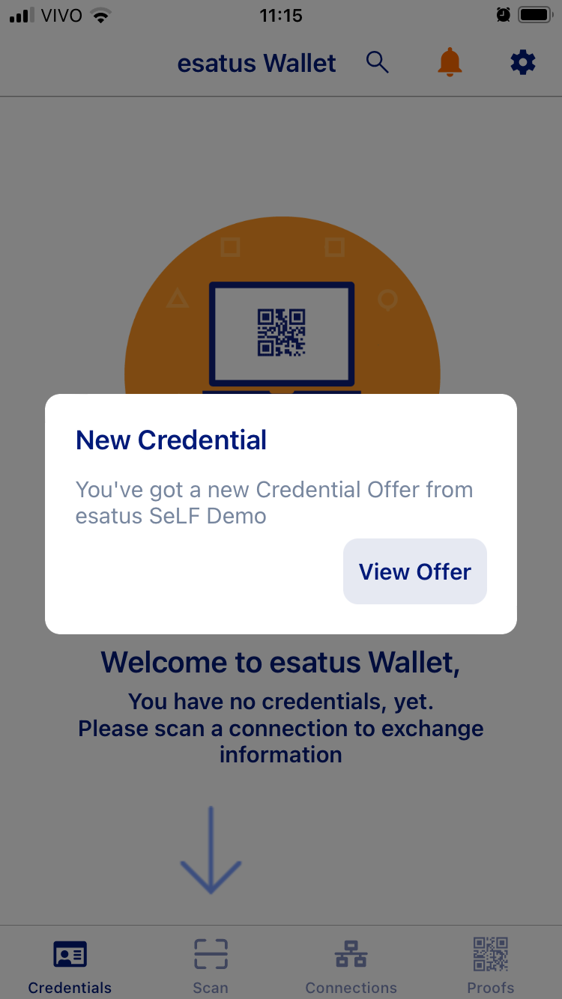

# Overview

# Identity Lifecycle

## Provision

In the provisioning phase, the user's first step is to establish a (secure) connection with the issuer, by reading a QR code.

The app installed on the user's device will show a notification asking to accept the connection.

Once the user accepts the connection, she can receive a verifiable credential (VC) offer from that issuer.

In the second step, the user clicks the *Create Credential* button. 

As there exists a direct link between the issuer and the user, the VC is transmitted to the user via this connection. Subsequently, a notification appears for the user, prompting them to accept the offer.

The user can view the VC offer and accept it.

Upon user acceptance, the VC is stored in the user's wallet.

The wallet provides users with the choice to enable automatic acceptance of VCs from that specific issuer.

### Privacy considerations

1. The wallet application requires a PIN to be entered for access and can also be set up to utilise the device's biometric unlocking feature.
2. The use of the terminology *Create a connection* and *Connection* is more user-friendly than DID (decentralised identifier) connection.
3. The choice for automatic acceptance of VC offers requires a more thorough analysis to understand its potential effects on user control and transparency.

## Usage, Update and Maintainance

## De-provision

# Final Remarks
