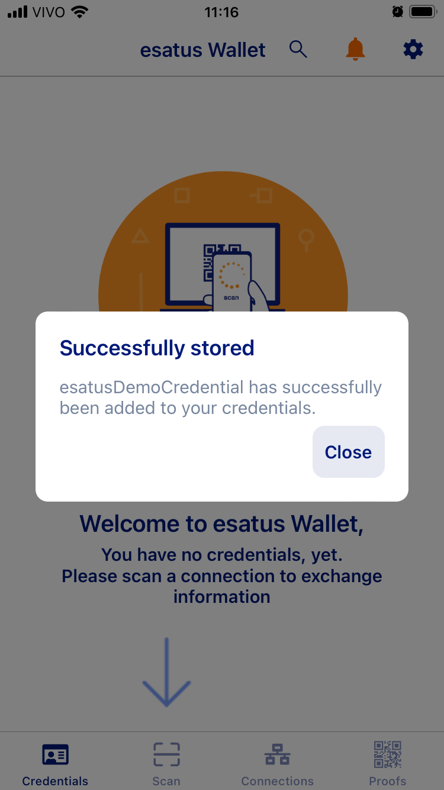

# Overview

Type:  mobile wallet

Developer url: [https://esatus.com/](https://esatus.com/)

Demo: [https://wallet-demo.esatus.com/](https://wallet-demo.esatus.com/)

# Identity Lifecycle

## Provision

In the provisioning phase, the user's first step is to establish a (secure) connection with the issuer, by reading a QR code.

The app installed on the user's device will show a notification asking to accept the connection.

Once the user accepts the connection, she can receive a verifiable credential (VC) offer from that issuer.

In the second step, the user clicks the *Create Credential* button. 

As there exists a direct link between the issuer and the user, the VC is transmitted to the user via this connection. Subsequently, a notification appears for the user, prompting them to accept the offer.

The user can view the VC offer and accept it.

Upon user acceptance, the VC is stored in the user's wallet.

The user can then see the credential details.

The wallet also provides users with the choice to enable automatic acceptance of VCs from that specific issuer.

### Privacy considerations

1. The wallet application requires a PIN to be entered for access and can also be set up to utilise the device's biometric unlocking feature.
2. The use of the terminology *Create a connection* and *Connection* is more user-friendly than DID (decentralised identifier) connection.
3. The (optional) choice for automatic acceptance of VC offers requires a more thorough analysis to understand its potential effects on user control and transparency.

## Usage, Update and Maintainance

For the tutorial, the user receives a proof request through the connection established with the issuer during provisioning.

When clicking on *View Request* the user can see the request details. A credential that meets the proof request is pre-selected for the user

The user has the option to choose a different credential by tapping on the issuer section or by tapping on the credential section.

Upon modifying (or leaving unchanged) the selected credential details and clicking 'send,' the credential is transmitted to the issuer. Subsequently, the user receives a confirmation indicating the successful sending of the credential.

### Privacy considerations

1. If a user holds multiple credentials that match the required type by the verifier, one of these credentials is automatically chosen and shown by default. The user might not be aware that they can change the pre-selected credential or might overlook this option, leading to the unintentional sharing of an incorrect credential.
2. As the demo provides a restricted amount of information within the credential, it remains uncertain whether the user can selectively choose which information from the credential she intends to share.

## De-provision

Once in their wallets, users can delete a credential.

# Final Remarks

The demo's experience is somewhat constrained as it primarily focuses on illustrating the protocols implemented by the wallet app — such as establishing a DID connection and communicating through it by offering a VC and requesting proof of a VC. The wallet provides PIN and biometric unlocking options, facilitating secure access to the app.

As the demo provides a restricted amount of information within the credential (just a user ID for testing purposes), it remains unclear whether the user would be able to selectively choose which information from the credential to share. There are potential privacy implications in two areas:

(a) Automatic Selection of Credentials: the automatic selection of a credential among multiple options might compromise user privacy if users are unaware of this selection or unable to easily modify it. This could inadvertently disclose sensitive information, impacting user privacy.

(b) Selective Information Sharing: the demonstration's constrained information presentation within the credential raises concerns about the user's ability to selectively share specific data. This lack of granularity in information sharing might pose privacy risks if users cannot control the data they disclose.