# Overview

Type: mobile wallet

Developer URL: [https://www.lissi.id/](https://www.lissi.id/)

Demo: [https://try.lissi.id/demo](https://try.lissi.id/demo)

# Identity Lifecycle

## Provision

In the provisioning phase, the user's first step is to establish a (secure) connection with the issuer, by reading a QR code 

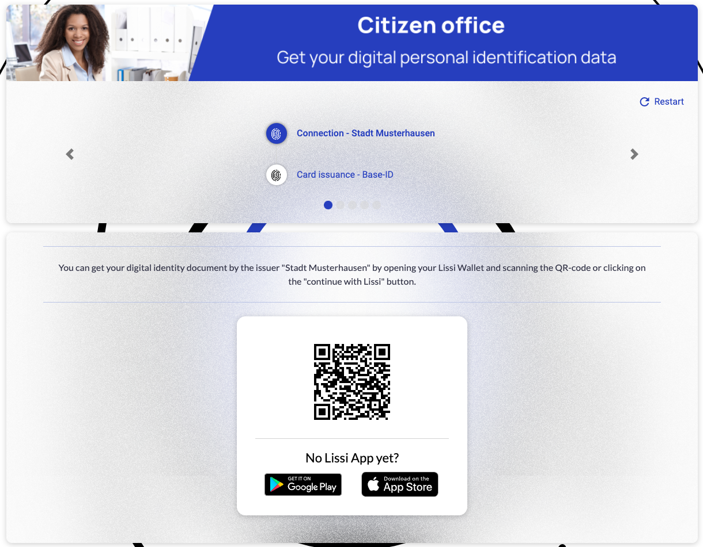

and accepting the connection:

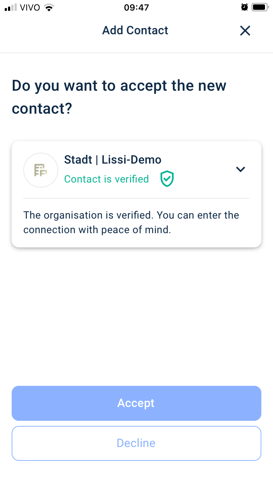

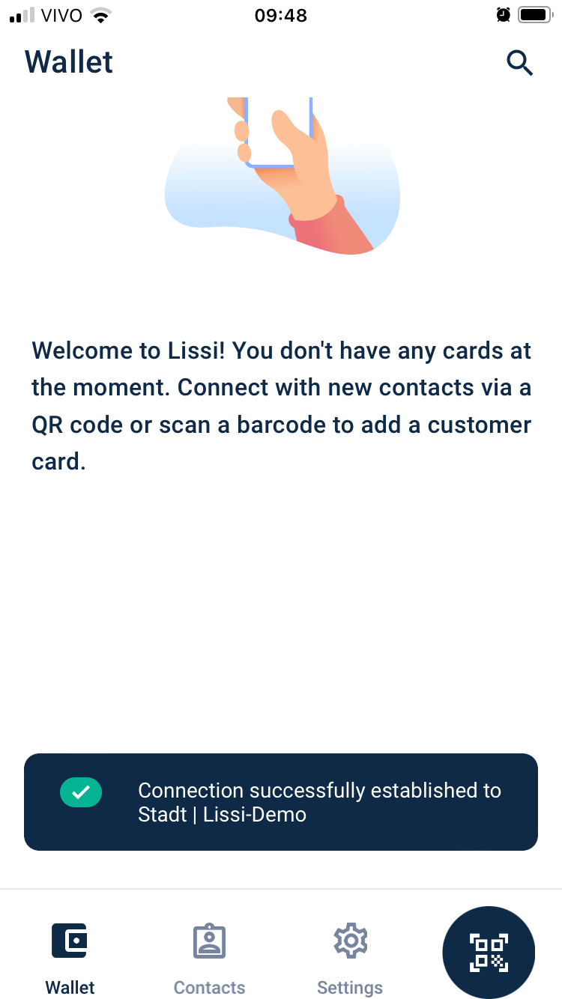

After establishing the connection, the user receives a credential offering:

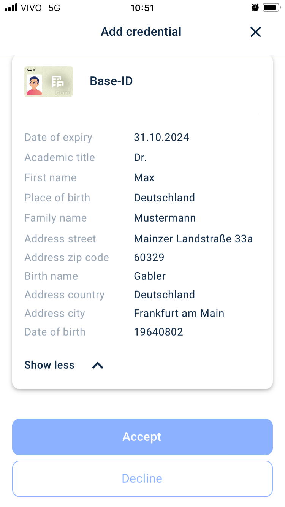

After the user accepts the credential offering, the credential is added to their wallet:

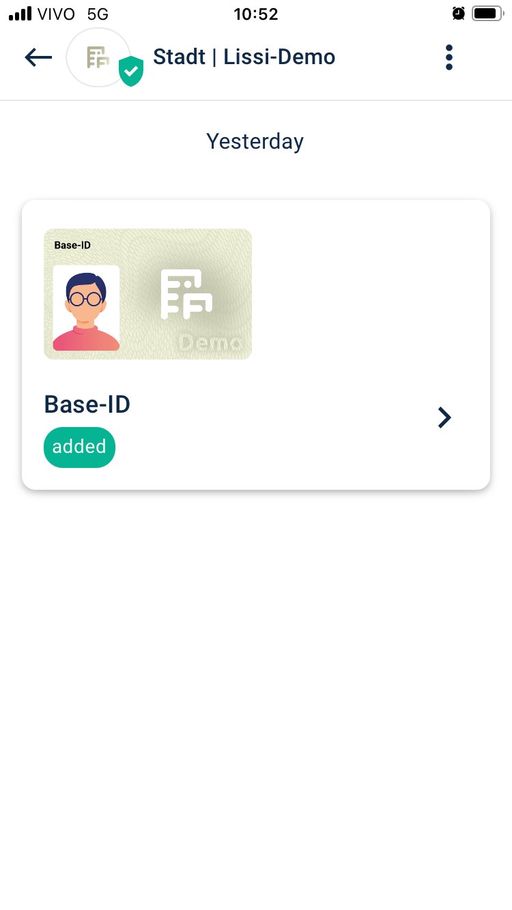

### Privacy considerations
1. The wallet application requires a PIN to be entered for access and can also be set up to utilise the device's biometric unlocking feature.

## Usage, Update and Maintainance

The tutorial provides a set of use cases. For example, the user can request a credit card, presenting the state ID received in the provisioning phase.

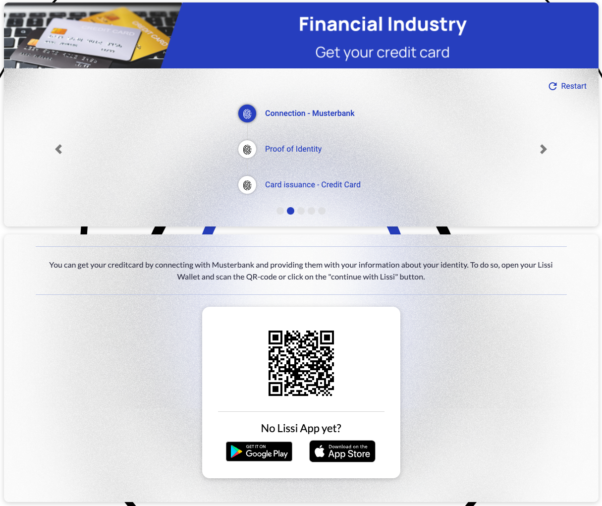

After reading the QR code, an identity proof is requested from the user:

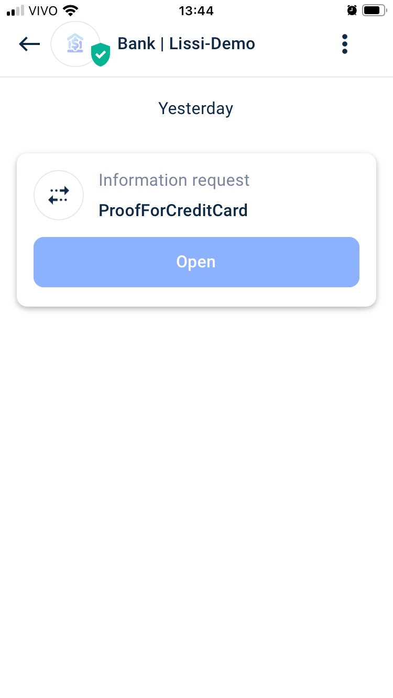

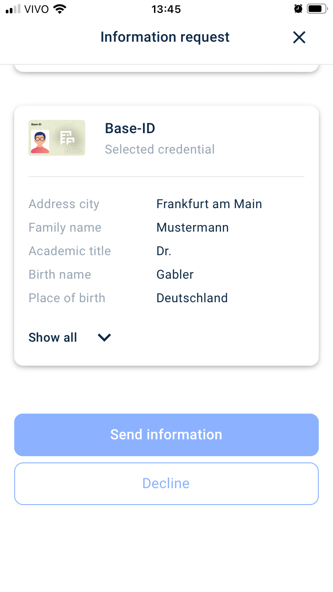

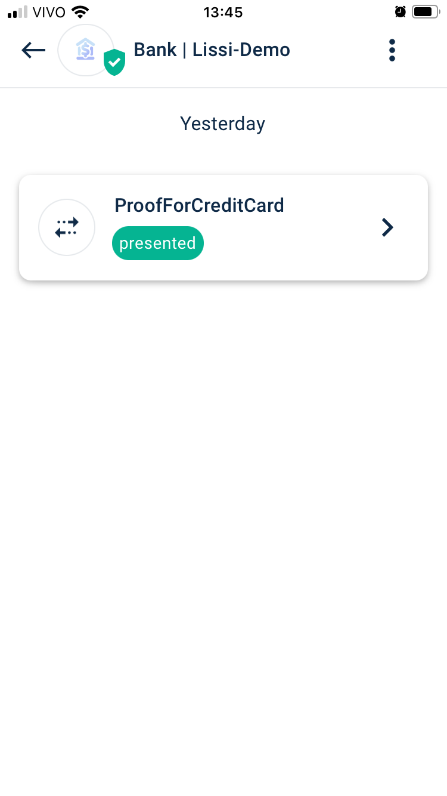

The user can see the details of the credential shared:

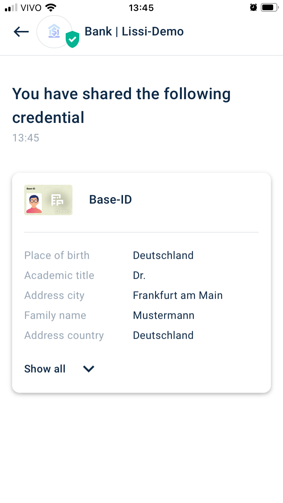

After proofing their identity, the user receives a credential offer of a credit card from the bank:

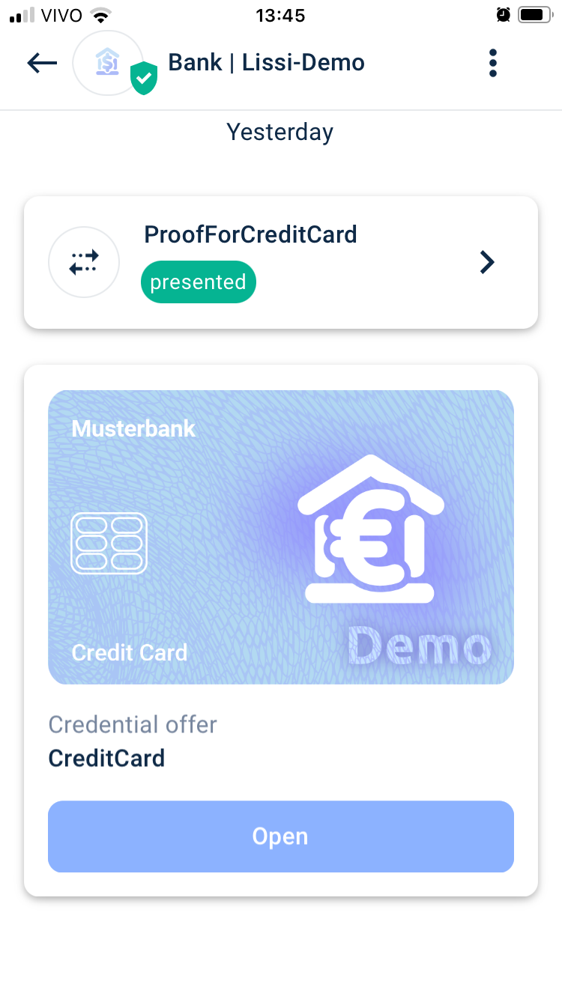

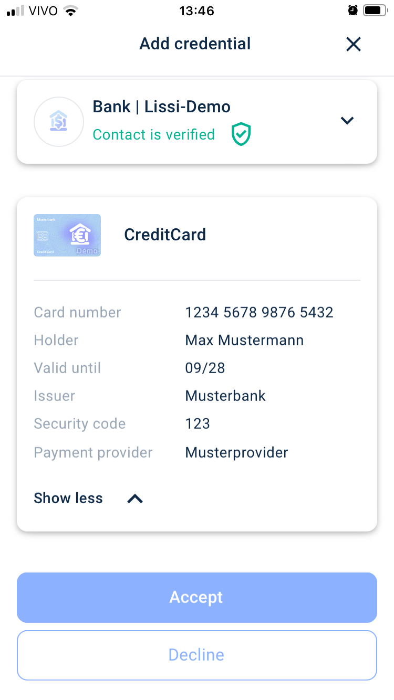

Upon accepting, the user has now a credit card VC added to their wallet:

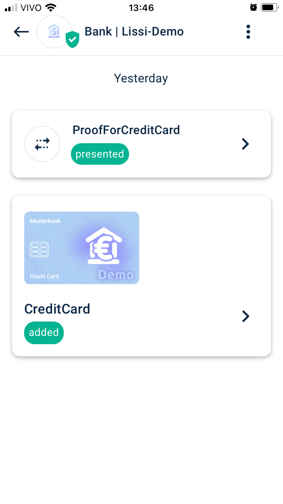

Later on, the user can use those VCs to check in to a hotel and so on.

### Privacy considerations

1. The user can't select which information to disclose from a VC.

2. The wallet app shows the sharing activities for each VC.

3. Provides some information on the identity requesting the info

## De-provision

To remove a credential from the wallet, users need to navigate to the top right corner, click the arrow to view the back of the credential, and then click the trash icon.

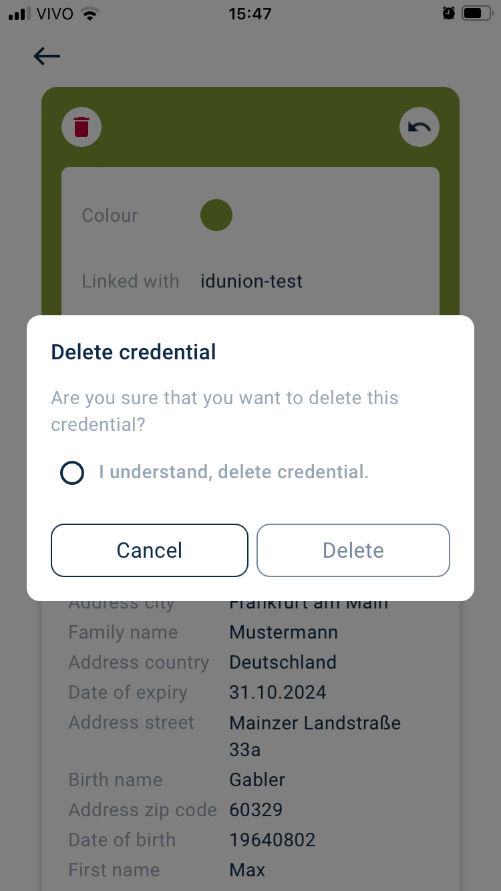

# Final Remarks

1. Selective Information Sharing (selective disclosure): the demonstration's constrained information presentation within the credential raises concerns about the user's ability to selectively share specific data. This lack of granularity in information sharing might pose privacy risks if users cannot control the data they disclose.

2. The overall experience is nice and provides several use cases, incremental ones.