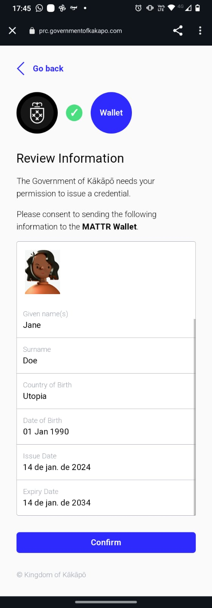
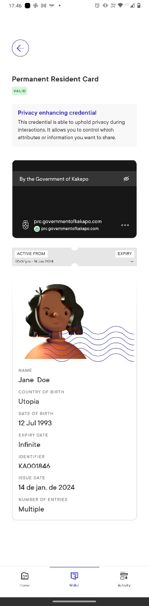
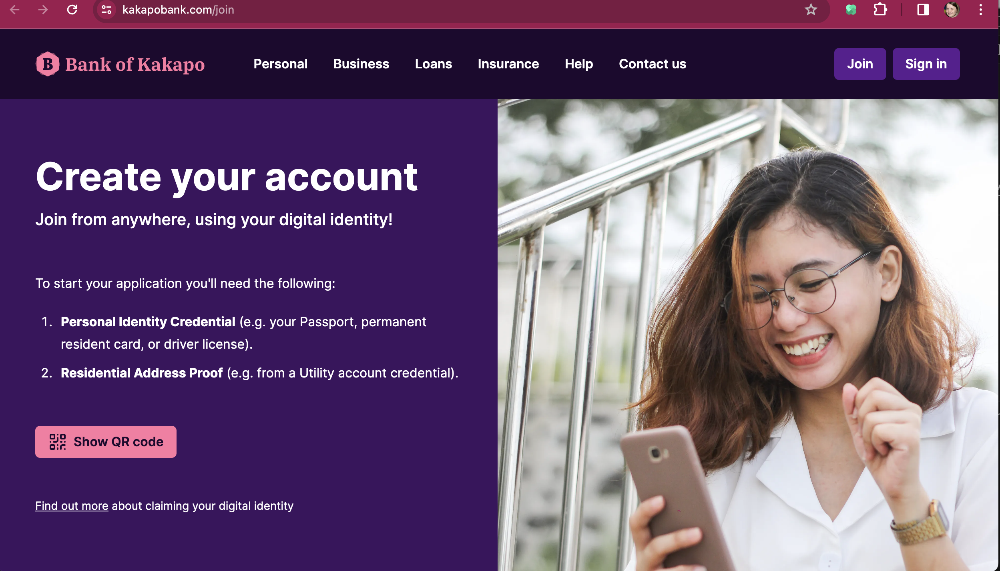
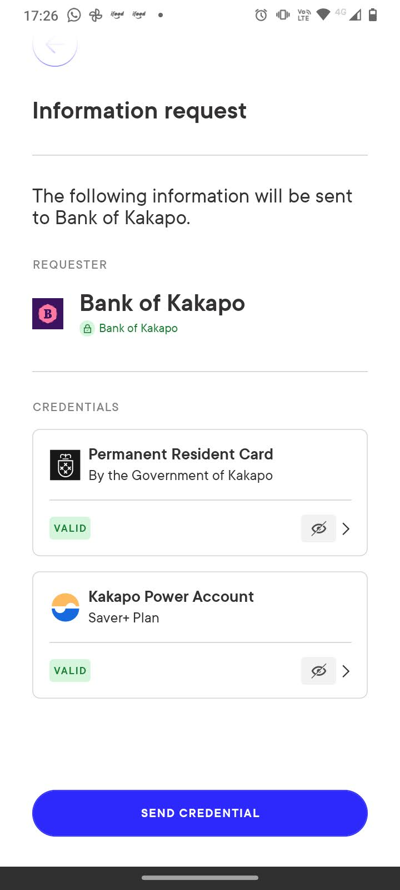
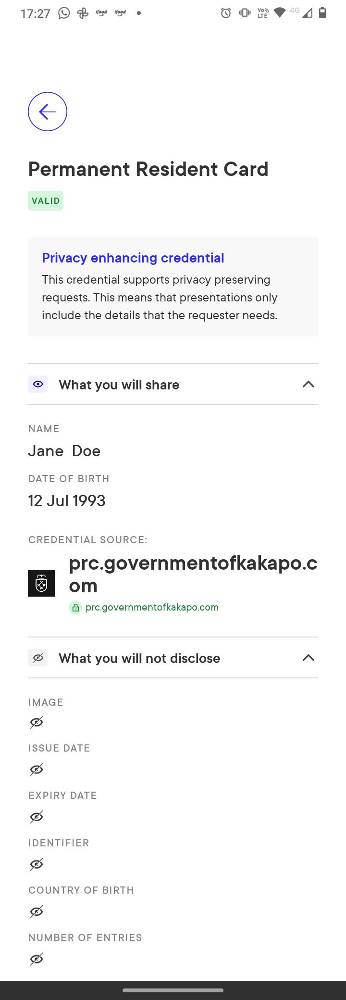
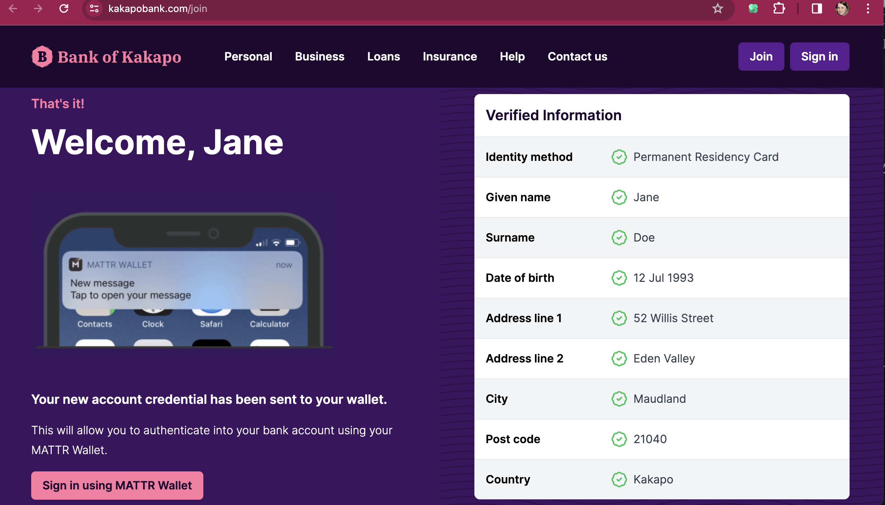
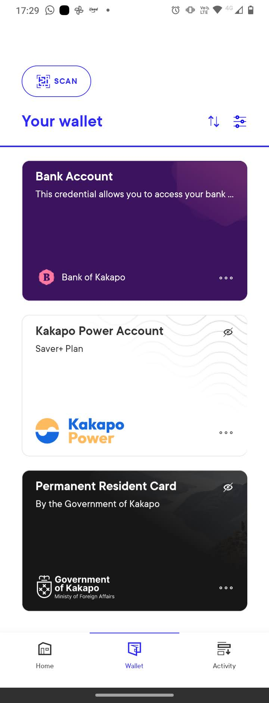
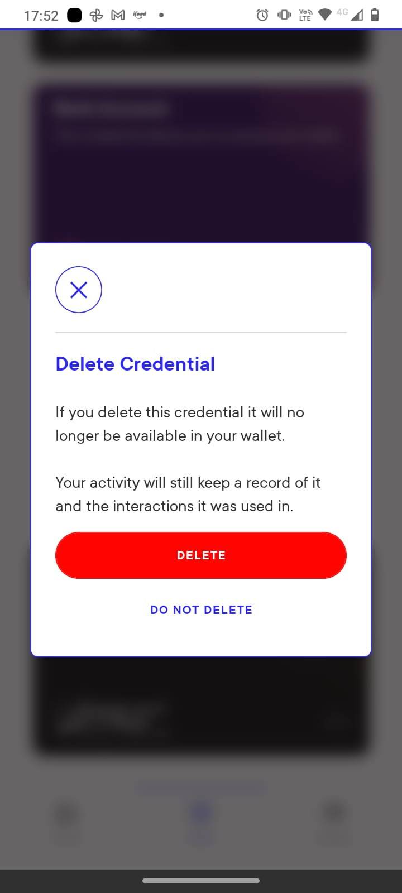

# Overview

Type: mobile wallet

Developer URL: [https://learn.mattr.global/tutorials/](https://learn.mattr.global/tutorials/)

Demo: [https://kakapo.mattr.global/](https://kakapo.mattr.global/)

# Identity Lifecycle

## Provision

The user reads a QR code to receive and accept a VC offer.

### Privacy considerations

1. The wallet application requires a PIN to be entered for access and can also be set up to utilise the device's biometric unlocking feature.

## Usage, Update and Maintainance

Users can present their VC in situations like opening a bank account, for instance.

Users can check what attributes will or won't be shared.

After sharing VCs with the bank, the user receives a VC for a bank account in that bank:

All user credentials are listed in the wallet section of the app:

### Privacy considerations

1. Implements selective disclosure
   

## De-provision
Users can delete a credential upon confirmation.

The app informs that the historical log of activity related to that VC will still be shown.

# Final Remarks

1. There is an activity log showing past interactions. It doesn't detail what specific attributes were shared, but that the credential was shared.

Didn't work well on iOs, so Android was used.