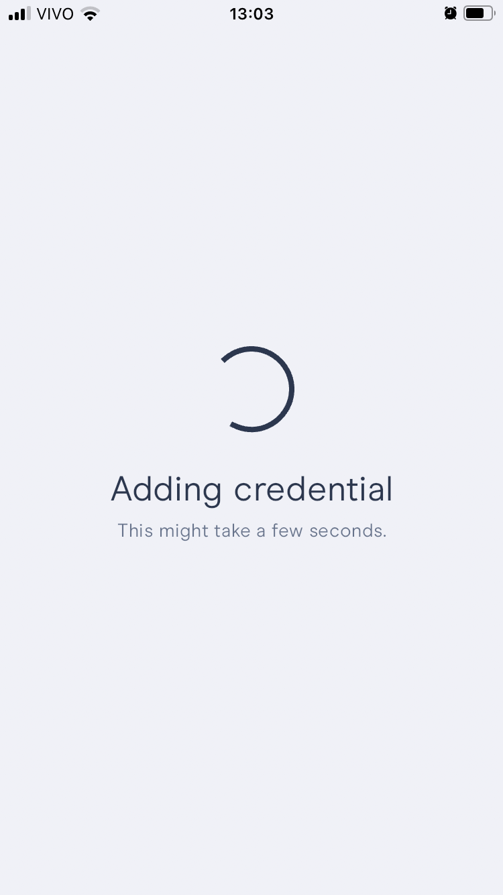

# Overview

Type:  mobile wallet

Developer URL: [https://polygonid.com/](https://polygonid.com/)

Demo: [https://devs.polygonid.com/docs/quick-start-demo](https://devs.polygonid.com/docs/quick-start-demo)

# Identity Lifecycle

## Provision

The user reads a QR code. A connection is requested to his/her wallet and once the connection is accepted, a VC offer is sent through that channel.

### Privacy considerations
1. The wallet application requires a PIN to be entered for access and can also be set up to utilise the device's biometric unlocking feature.

## Usage, Update and Maintainance

Once the user receives their credential, they can use it with any verifier that accepts such credentials.
In the demo, users can present the VC to confirm attendance at an event.

The user reads a QR code from the verifier and proceeds with the verification process.

The verifier page notifies that the verification was successful.

### Privacy considerations

1. As the demo provides a restricted amount of information within the credential, it remains uncertain whether the user can selectively choose which information from the credential she intends to share. However, the implementation does advertise selective disclosure and zero-knowledge proof. A further deeper test is needed.
   
2. There's no history of sharing/verifications.

## De-provision

Users can remove on or all credentials from their wallets.
They can also remove the entire wallet (a recovery phrase will be needed to restore the wallet), in a feature called "Remove my identity"

# Final Remarks

Could read the QR code more than once, but didn't duplicate the credential.