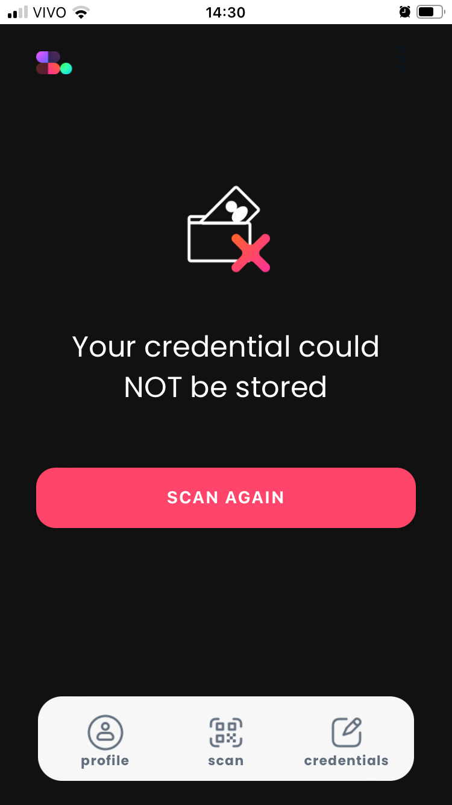
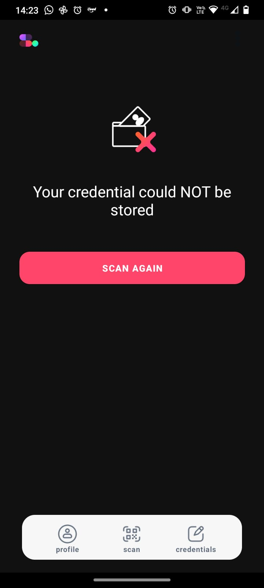

# Overview

Type:  browser-based wallet

Developer URL: [https://sideos.io/](https://sideos.io/)

Demo: [https://docs.sideos.io/](https://docs.sideos.io/)

# Identity Lifecycle

## Provision

### Privacy considerations
- no pin for app

## Usage, Update and Maintainance

### Privacy considerations

## De-provision

# Final Remarks

Setting up a local environment requires creating an admin account on their remote API. However, the authentication flow to access the remote admin dashboard is not functioning, as it requires saving a VC with the transponder app (for authentication), but an error prevents successful saving, both in Android and iOS.

