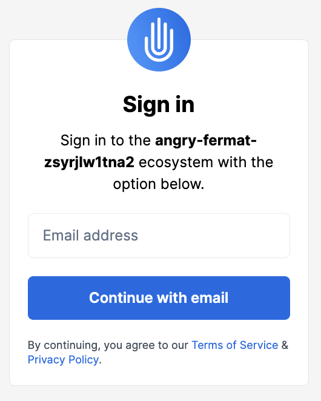
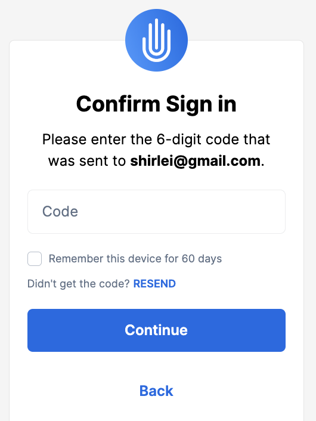
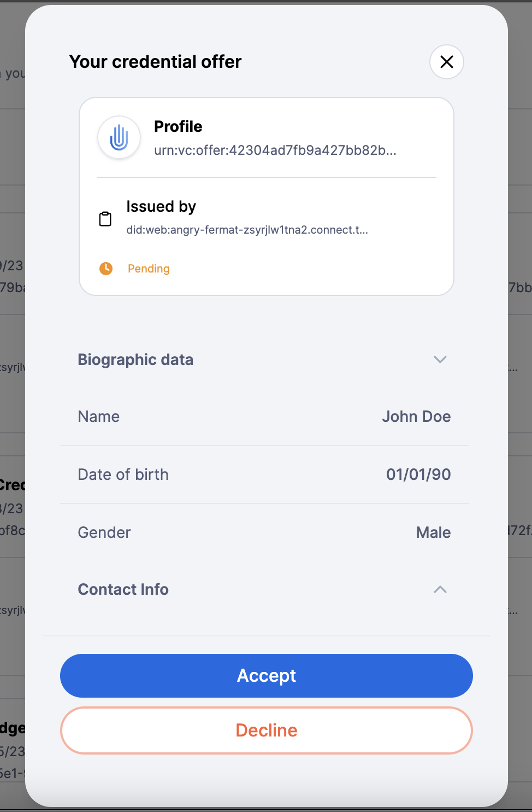
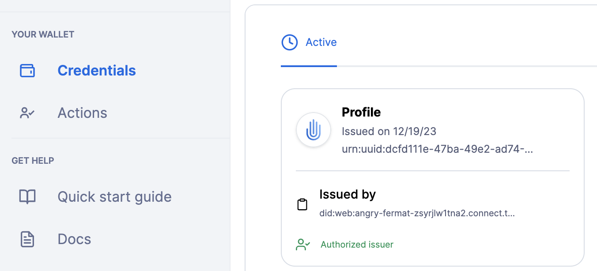
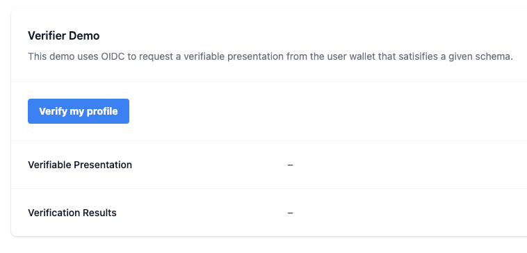
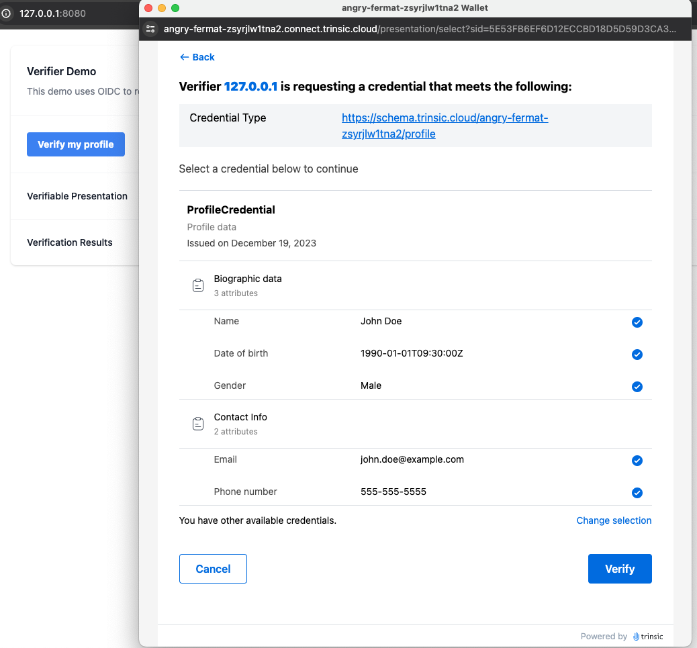
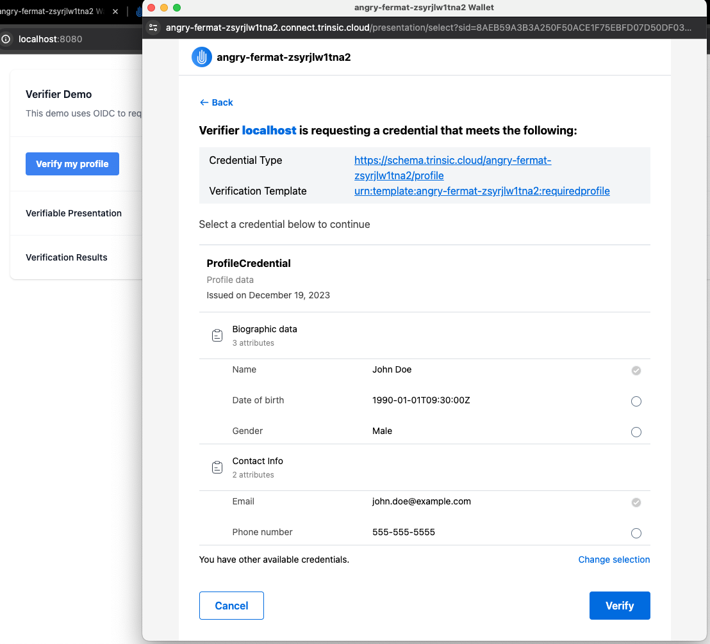
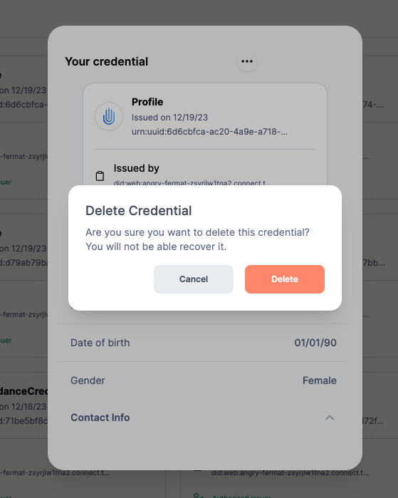

Trinsic.id

# Overview

Type: Cloud wallet

Developer url: [https://trinsic.id/](https://trinsic.id/)

Documentation: [https://docs.trinsic.id/guide/platform-walkthrough/](https://docs.trinsic.id/guide/platform-walkthrough/)

Demo:  [https://dashboard.trinsic.id](https://dashboard.trinsic.id)

Note: During the tool selection process, the Trinsic ID wallet was initially chosen from the Apple Store. However, upon closer examination, it was discovered that the mobile version is limited in its use, functionality and user base, being specifically designed for Trinsic and its partners in a product known as "Trinsic Connect."

For issuing and storing verifiable credentials, the service available at https://dashboard.trinsic.id provides access to a service called *White Label Wallet*, which provides cloud wallets in both free and paid plans. For this assessment, the free plan is used.
In paid plans, users have access to a larger quantity of wallets and credentials. They can log in to wallets using any OIDC-compliant IdP. However, in the free plan, a *sandbox to build demos and understand the concepts*, there's a limit of 10 wallets and 100 credentials. Additionally, users are required to log in to wallets using their email

# Identity lifecycle

## Provision

An issuer issues a verifiable credential for a subject.

Example:

An issuer issues a profile credential with biographic (name, date of birth and gender) and contact info (email and phone number) to the user.

The credential can be delivered to the user via email or through the sharing of a web link or QR code. Each of these options directs the user to a web page where they are prompted to provide their email if not already logged in.

Upon clicking the link or scanning the QR code, if the user isn’t logged into the cloud wallet, they will be directed to a sign-in page. However, if the user is already logged in, this step is skipped.

The user is required to provide an email and subsequently use a one-time password code sent to the provided email in the next step.

After entering the received code and completing the login process, a pop-up appears, presenting the user with the *credential offer*:

After accepting the offer, the credential is listed in the cloud wallet:

### Privacy considerations:

1. DID terminology might not be easily understandable for all users. Therefore, in the 'Issued by' section, it would enhance transparency to provide clear details about the actual issuer. This includes information such as the organisation's name and additional details that could be expanded upon to offer more comprehensive information.
2. In line with standard practices seen in most online services, the cloud wallet in the free plan requires users to provide an email address. In the absence of an email confirmation process, it's essential to establish a means of verifying that the intended recipient is the rightful owner of the provided email address. Without such verification measures, there's a risk that the verifiable credential could be inadvertently delivered to an unintended recipient. 
As the assessment was done in the free plan where only this option is available, it is not clear if, in the production ecosystem of paid plans, emails can be used this way to log in to wallets.

## Usage, Update and Maintainance

Once the user receives their credential, they can use it with any verifier that accepts such credentials.

In the Trinsic demo, users can access an online service acting as the verifier and click on the 'verify my profile' button. 

trinsic-credential-accepted.png
If the user is already logged into their wallet, a new window appears, displaying the credential and its associated attributes ready to be shared. However, if the user is not logged in, they will encounter the login flow prompting them to enter the email associated with their wallet, as described in the provision section.

When the verifier specifies a mandatory set of attributes, the new window displays these required attributes as pre-selected, preventing the user from deselecting them. Additionally, other available attributes are shown as unselected. This differs from situations where no mandatory attributes are set, as in those cases, all available attributes were initially presented as pre-selected.

In the paid plans (while we're currently using the free plan for testing), users will have the capability to export the credential as a "shared pass" to Google or Apple wallets. This shared pass is essentially a representation of the credential and includes a QR code. When scanned, this QR code redirects to Trinsic's branded studio, specifically to a validation page for verification.

### Privacy considerations:

1. When a user possesses multiple credentials matching the verifier's required type, one of them is automatically pre-selected and displayed. Towards the end of this selected credential, a prompt saying "You have other available credentials" appears, offering an option to modify the selection. However, there's a possibility that the user might overlook this message and unintentionally share an incorrect credential.
2. When the verifier doesn't specify any mandatory attributes, all available attributes within the credential are automatically selected. This approach contradicts the principles of data minimisation and privacy by default. In such cases, a more privacy-conscious approach would involve not pre-selecting any attributes, allowing users to manually choose the ones they wish to share.
3. A notable feature of the implementation is the ability to practice selective disclosure. This means that users can utilise a verifiable credential without having to disclose all of its attributes at once.

## De-provision

Once in their wallets, users can delete a credential.

# Final Remarks

The user's experience involves receiving a verifiable credential during a provisioning step initiated by the online service. Initially, a service-specific onboarding occurs (which is out of scope), followed by the issuance of the credential. Subsequently, the user receives notification of the issuance through email, a web link, or a QR code, prompting them to accept the credential offer.

However, if the user already has a cloud wallet linked to the email address used for sending the credential offer, the offer doesn't appear upon logging into the wallet. In this case, the user needs to explicitly open the URL provided for that specific offer to view and accept it.

Offering multiple methods to access the credential offer, beyond solely relying on QR code scanning, is a notable advantage. This approach is particularly advantageous because QR codes have faced some criticism regarding their usage.

Regarding privacy, in the provisioning phase, enhancing transparency within the wallet application is crucial. Simplifying technical terms like DID (decentralized identifier) and providing clear issuer details could improve user understanding and transparency. Additionally, the absence of robust email verification in the free plan poses a risk of unintended credential delivery, highlighting the need for secure recipient verification.

Transitioning to the usage phase, the automatic pre-selection of credentials and attributes contradicts privacy principles. Users might unintentionally share incorrect credentials due to default selections. A more privacy-by-default approach involves allowing users to manually select attributes for sharing. The implementation's selective disclosure feature is noteworthy, enabling users to share specific attributes without revealing all information at once.