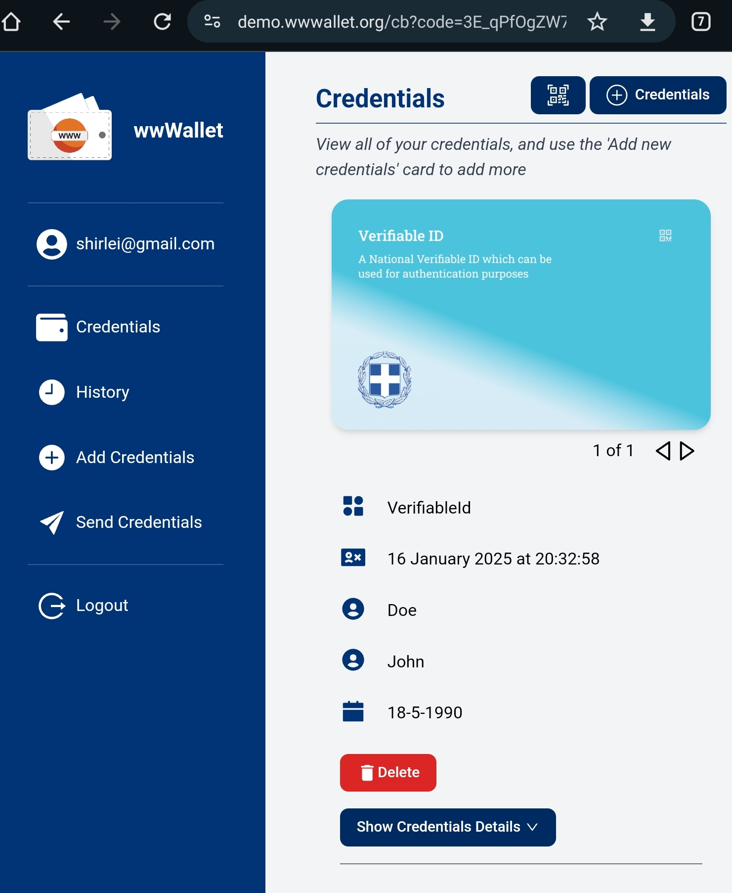

# Overview

Type:  web wallet

Developer URL: [https://wwwallet.github.io/wallet-docs/](https://wwwallet.github.io/wallet-docs/)

Demo: [https://demo.wwwallet.org](https://demo.wwwallet.org)

# Identity Lifecycle

## Provision

Users can read a QR code or "open wwWallet" from the browser they have the wwWallet accessible.
Clicking on 'open wwWallet' redirects to the issuer, where the user can consent to receive the VC:

After selecting and confirming the VC to be received, the user is redirected to the wallet, showing the received credential:

### Privacy considerations

## Usage, Update and Maintainance

After receiving and storing a VC, users can present it for proof in several scenarios, like the issuance of another VCs or applying for a job.

Getting a diploma VC by presenting the ID VC:

Applying for a job presenting the diploma VC:

### Privacy considerations

1. No selective disclosure observed
  
## De-provision

Users can delete a credential, with all the presentation history being also deleted.

# Final Remarks

Login in the wallet using passkeys, with compatibility considerations
